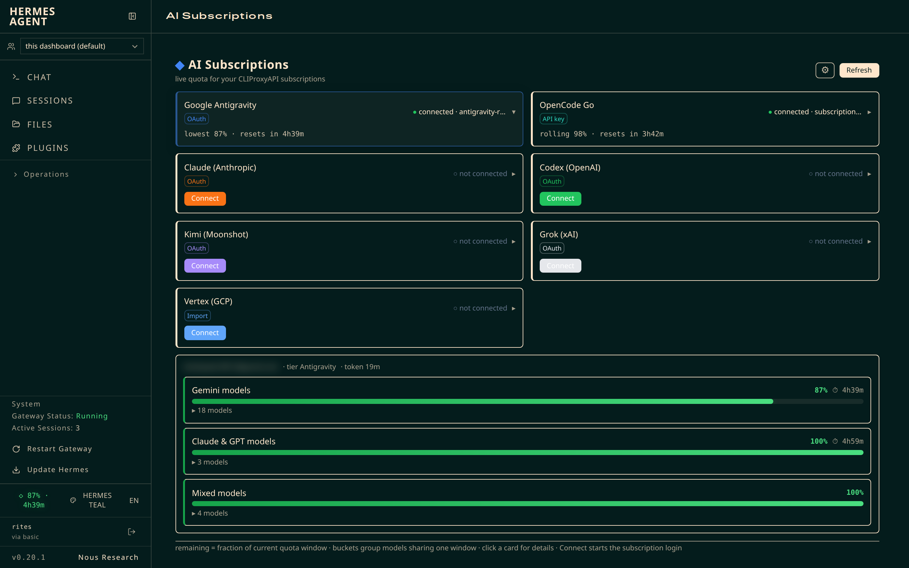
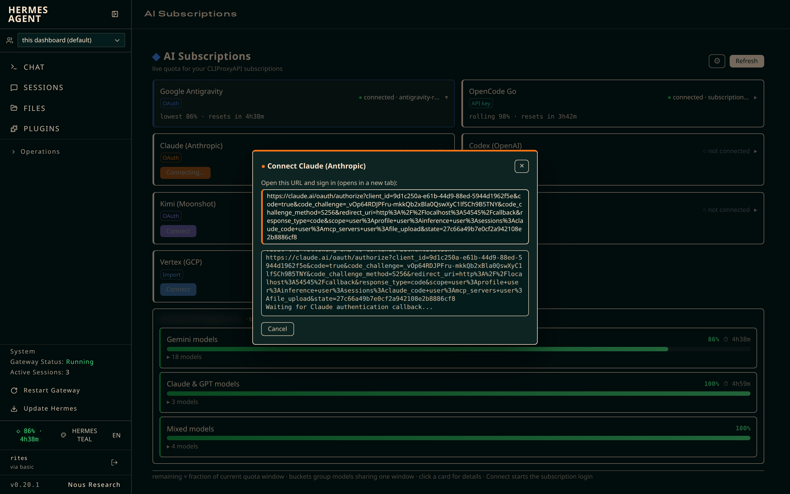
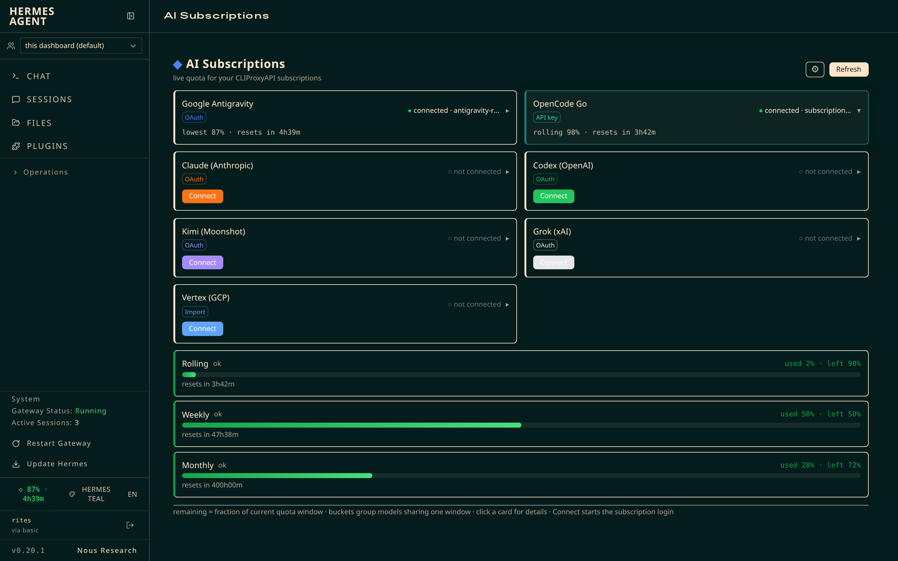

# CPA Quota — Hermes quota dashboard

A Hermes Desktop plugin backed by [CLIProxyAPI](https://github.com/router-for-me/CLIProxyAPI). It shows provider quota, reset times, OpenCode Go usage, and connection controls from the dashboard tab or desktop pane.



## Features

- **Live quota** — Google Antigravity per-window buckets (Gemini models share one window, Claude & GPT another), remaining %, reset countdown ticking every second, model list per bucket, tier + credits.
- **OpenCode Go usage** — rolling / weekly / monthly percent used with reset times.
- **One-click connect** — Antigravity, Claude, Codex, Kimi, Grok (xAI), Vertex (file import). Click **Connect**, the plugin runs the proxy's real login flow, shows you the OAuth URL + live output, and detects the new auth file on success.
- **Statusbar chip** — lowest window % + countdown right in the dashboard header (⚠ when below your threshold).
- **Settings** — refresh interval, alert threshold, hosts, auth dir — from a ⚙ popover, persisted to `config.json`.
- **History** — 7-day quota samples with resampled charts data via `GET /history`.





## Requirements

- **Hermes Agent** (dashboard or desktop app) with plugins enabled
- **CLIProxyAPI** (`cli-proxy-api`) running on `127.0.0.1:8317` — [get it here](https://github.com/router-for-me/CLIProxyAPI)
- At least one logged-in subscription in the proxy's auth dir (`~/.cli-proxy-api/` by default)

## Install

```bash
git clone https://github.com/<your-user>/cpa-quota.git
cd cpa-quota
./install.sh          # copies files + enables the plugin
```

Then **restart the dashboard** (or relaunch the Hermes desktop app) and open the **AI Subscriptions** tab.

### Manual install

```bash
HERMES_HOME="${HERMES_HOME:-$HOME/.hermes}"
mkdir -p "$HERMES_HOME/plugins/cpa-quota/dashboard" "$HERMES_HOME/desktop-plugins/cpa-quota"
cp plugin.yaml __init__.py config.example.json "$HERMES_HOME/plugins/cpa-quota/"
cp dashboard/* "$HERMES_HOME/plugins/cpa-quota/dashboard/"
cp desktop/plugin.js "$HERMES_HOME/desktop-plugins/cpa-quota/plugin.js"
hermes plugins enable cpa-quota
```

## How it works

| Piece | What it does |
|---|---|
| `dashboard/plugin_api.py` | FastAPI backend mounted by the dashboard: fetches quota from Google's `v1internal:fetchAvailableModels` using the OAuth token already stored by `cli-proxy-api`, tracks usage history, and drives login subprocesses (`cli-proxy-api -config <cfg> -<provider>-login -no-browser`). |
| `dashboard/dist/index.js` | Plain-JS web bundle (no build step): provider cards, quota buckets, usage bars, connect modal, settings. |
| `desktop/plugin.js` | Electron desktop pane + statusbar chip with the same data. |
| `plugin.yaml` / `__init__.py` | Native registry entry so `hermes plugins enable cpa-quota` works. |

The plugin **never asks for your tokens** — it reads the auth files the proxy already maintains in
`~/.cli-proxy-api/` (or your configured `auth_dir`) and refreshes them in-process.

## Providers

| Provider | Kind | Connect via |
|---|---|---|
| Google Antigravity | OAuth | `-antigravity-login` |
| Claude (Anthropic) | OAuth | `-claude-login` |
| Codex (OpenAI) | OAuth | `-codex-login` |
| Kimi (Moonshot) | OAuth | `-kimi-login` |
| Grok (xAI) | OAuth | `-xai-login` |
| Vertex (GCP) | Service-account import | `-vertex-import <file.json>` |
| OpenCode Go | API key | `OPENCODE_GO_API_KEY` (see below) |

### OpenCode Go usage

Set the API key once and the plugin shows rolling/weekly/monthly usage from
`https://opencode.ai/zen/go/v1/usage`:

```bash
# in ~/.hermes/.env or ~/.hermes/profiles/<profile>/.env
OPENCODE_GO_API_KEY=op_...
```

## Configuration

All keys are optional. Either edit `~/.hermes/plugins/cpa-quota/config.json` (created from
`config.example.json`) or set env vars.

| Key | Default | Description |
|---|---|---|
| `auth_dir` | `~/.cli-proxy-api` | Where the proxy keeps auth files (`CPA_QUOTA_AUTH_DIR`) |
| `hosts` | daily, prod `cloudcode-pa.googleapis.com` | Quota API hosts tried in order (`CPA_QUOTA_HOSTS`) |
| `load_hosts` | prod, daily | Tier/credits host order |
| `refresh_interval_seconds` | `60` | Quota poll interval (min 15) |
| `low_threshold` | `0.1` | Chip ⚠ below this remaining fraction |
| `selected_auth_file` | newest | Which `antigravity-*.json` to use |
| `proxy_bin` | `cli-proxy-api` | Path to the proxy binary (`CPA_QUOTA_PROXY_BIN`) |
| `proxy_config` | `~/.local/share/cliproxyapi/config.yaml` | Proxy config for login subprocesses (`CPA_QUOTA_PROXY_CONFIG`) |
| `token` | — | Manual OAuth access token override (`CPA_QUOTA_TOKEN`) |
| `models` / `primary_model` | all / first | Model allowlist + chip target |

## API (for other plugins / scripts)

All under `/api/plugins/cpa-quota/`:

- `GET /quota` — buckets, models, tier, account, alerts, opencode usage, config
- `GET /providers` — provider list with connected status
- `POST /connect` — `{provider}` or `{provider:'vertex', file:'/abs/path.json'}`
- `GET /connect/status` · `POST /connect/cancel` — login progress / cancel
- `GET /config` · `PUT /config` · `GET /accounts` · `GET /history` · `GET /health`

## Troubleshooting

| Problem | Fix |
|---|---|
| "no quota data" | Check `auth_dir` contains an `antigravity-*.json` with a valid OAuth refresh token |
| Quota fetch slow / 429s | The prod host can 429 when quota is tight; the plugin fails over to the daily host automatically |
| Connect shows a URL for the wrong provider | Fixed in v4 — a stale login from another provider is auto-terminated; cancel any running flow and retry |
| Dashboard shows old version | Hard-refresh (Ctrl/Cmd+Shift+R); backend changes need a dashboard restart |
| Backend unreachable | Confirm `cpa-quota` is in `hermes plugins list` output |

## Privacy & disclaimers

- Tokens never leave your machine and are never logged.
- The quota endpoints are the same `v1internal` APIs the Antigravity CLI itself uses; they are unofficial and may change upstream.
- Not affiliated with Google, Anthropic, OpenAI, Moonshot, xAI, or opencode.ai.
- The proxy binary (`cli-proxy-api`) is developed by [router-for-me](https://github.com/router-for-me/CLIProxyAPI).

## License

[MIT](LICENSE)
